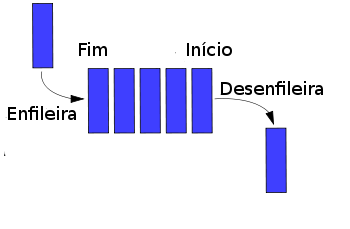

# Informações

Queue, traduzido para o português como fila, é uma estrutura de dados linear que opera com o princípio FIFO (First In, First Out - Primeiro a Entrar, Primeiro a Sair). Imagine uma fila de espera no banco: a pessoa que chega primeiro na fila (entra) é a primeira a ser atendida (sai).

# Funcionamento

- Os elementos são inseridos na traseira da fila (enqueue).
- Os elementos são removidos da frente da fila (dequeue).

# Operações básicas

- **enqueue (Enfileirar):** Adiciona um elemento na parte traseira da fila.
- **dequeue (Desenfileirar):** Remove e retorna o elemento da frente da fila.
- **isEmpty:** Verifica se a fila está vazia.
- **size:** Retorna o número de elementos na fila.

# Exemplos de uso

- Filas de espera (atendimento, processos)
- Buffer de dados (armazenamento temporário)
- Algoritmos de busca (como Breadth-First Search - Busca em Largura)
- Gerenciamento de tarefas (fila de impressão)

# Vantagens

- Eficiente para processar itens em uma ordem sequencial.
- Simples de implementar.

# Desvantagens

- Acesso aleatório lento (acessar um elemento específico no meio da fila é trabalhoso).

# Exemplos de implementações

- **Lista encadeada:** Estrutura flexível que permite fácil inserção e remoção de elementos.
- **Array:** Acesso aleatório mais rápido, mas pode ser menos eficiente em termos de memória se a fila precisa crescer ou encolher frequentemente.